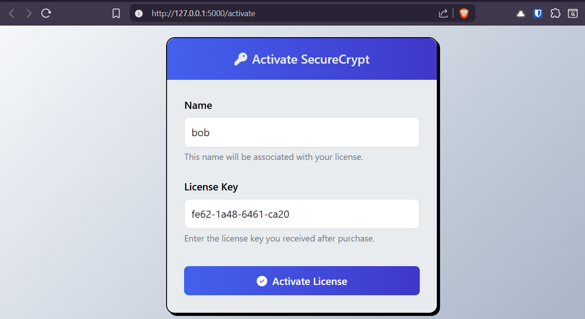

# SecureCrypt

Secure Crypt my encryption tool that encrypts and decrypts files directly in your browser. 
No files leave your computer.

The whitepaper for Secure Crypt is also available.

 
5
Once you launch your SecureCrypt.exe, SecureCrypt will start a WSGI server that runs completely in your computer. This server will immediately bring up http://127.0.0.1:5000/ which will bring you to an activation page.

 

 

 

 

 

 

 

 

 

 

 

