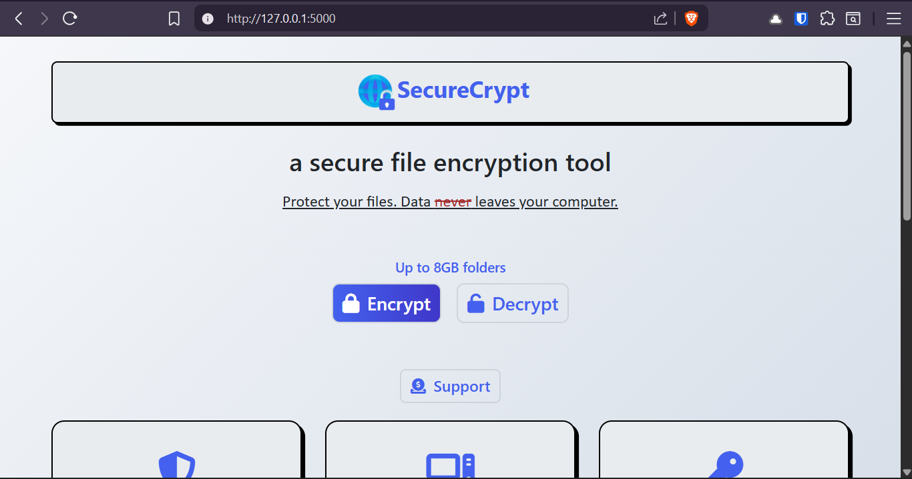

# SecureCrypt - File Encryption Desktop App

A secure, client-side file and folder encryption tool that never sends your data over the internet.

## Features

- ✅ AES-256 encryption with HMAC verification
- ✅ Encrypt files & folders up to 8GB
- ✅ Folder encryption (zip-based)
- ✅ Client-side processing - files never leave your computer
- ✅ No installation required (portable executable)

## Download

[[Download Latest Version]
(https://github.com/Oascent1/seccrypt/releases/tag/SecureCrypt.exe)

## Usage

1. Download the executable
2. Use the web interface to encrypt/decrypt files
3. Your files are processed locally and never uploaded

## Building from Source

[Include build instructions here]

## Security

This app uses:
- AES-256-CBC encryption
- PBKDF2 key derivation (100,000 iterations)
- HMAC-SHA256 authentication
- All processing happens locally on your machine

 
Once you launch your SecureCrypt.exe, SecureCrypt will start a WSGI server that runs completely in your computer. This server will immediately bring up http://127.0.0.1:5000/ on your browser.

 
This page will pop up immediately after you activate your SecureCrypt .exe. All the files you encrypt and decrypt will be done directly in your browser and will not leave your computer. We're going to head back to the desktop so we can use an example document for encryption.

 
This is my example.docx file we will be encrypting and decrypting. We're going to head back to our webpage and click the 'Encrypt a File' button seen above.

 

We're going to press 'Click to browse files' to bring up our local files. I'm going to click my example.docx file to encrypt.

 

After selecting a file, we're going to create a strong password. it's important to remember this password, as your files cannot be decrypted without this password.

 

Once you've made a strong password, click 'Encrypt & Download'. Instructions for how to edit your encrypted file name are under the 'Encrypt & Download ' button. It's important you read those instructions if you plan to edit the name of your file.

 

Here we have our new encrypted file with the .safe extension. We're going to open it to show what will be seen if someone tried to access it.

 

As you can see, our file has been completely scrambled with over 11,000 random characters.

 

Next, we're going to click the 'Decrypt a File' button, as seen on the second picture, and upload our encrypted file. We're going to type in our password and click the 'Decrypt & Download' button.

 

And just like that, we have decrypted our file. Let's open it up to see if it worked.

 

Our decrypted file.

 

Verifying File Integrity (Windows)

Download the SecureCrypt_v2.0_Windows.zip file from the Releases page and extract it.

Open PowerShell in the extracted folder.

Run the command:
Get-FileHash -Path .\SecureCryptPro.exe -Algorithm SHA256

Open the SHA256SUMS.txt file provided and verify that the hash output by the command matches the hash in the file exactly.

