# SecureCrypt

Secure Crypt my encryption tool that encrypts and decrypts files directly in your browser. 
No files leave your computer.

The whitepaper for Secure Crypt is also available.

Once you launch your SecureCrypt.exe, SecureCrypt will start a WSGI server that runs completely in your computer. This server will immediately bring up http://127.0.0.1:5000/ which will bring you to an activation page.

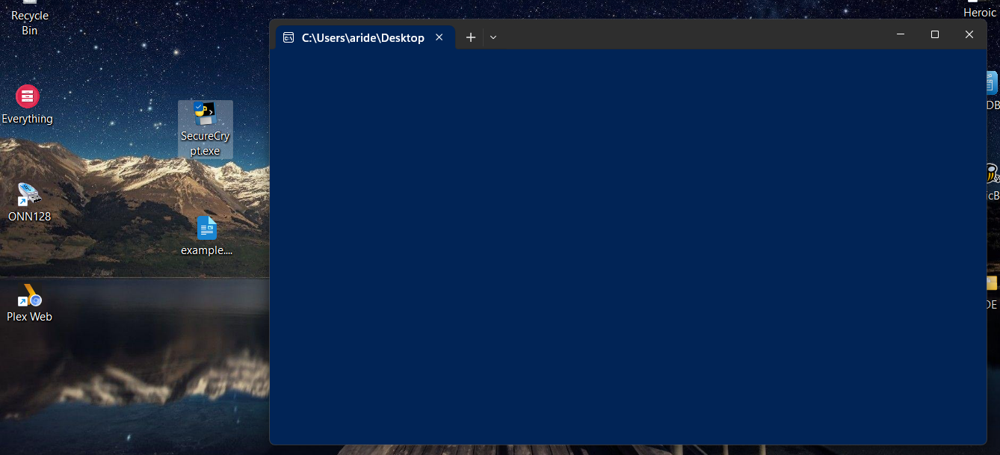

 
This page will pop up immediately after you activate your SecureCrypt .exe. All the files you encrypt and decrypt will be done directly in your browser and will not leave your computer. We're going to head back to the desktop so we can use an example document for encryption.

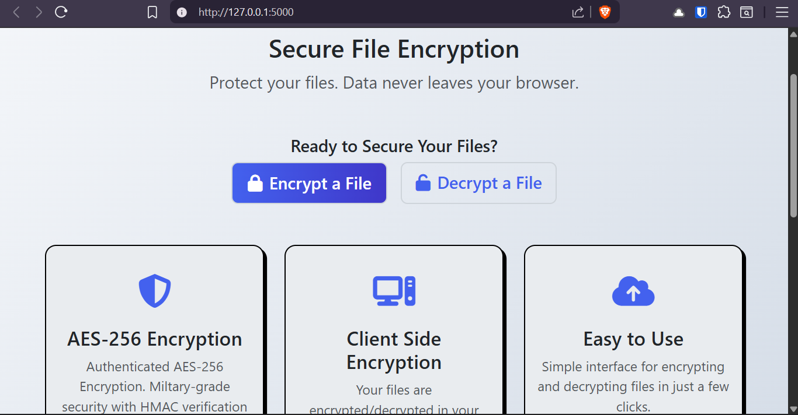

 
This is my example.docx file we will be encrypting and decrypting. We're going to head back to our webpage and click the 'Encrypt a File' button seen above.

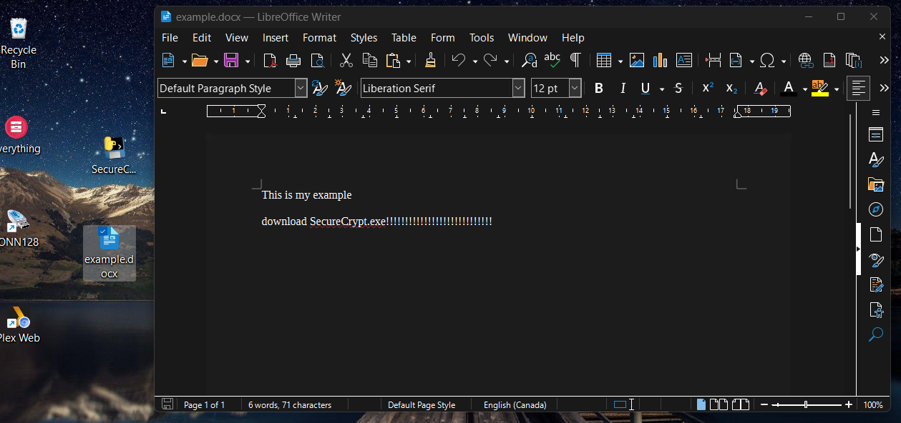

 

We're going to press 'Click to browse files' to bring up our local files. I'm going to click my example.docx file to encryp

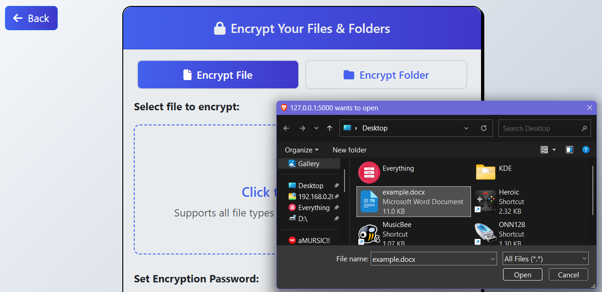

 

After selecting a file, we're going to create a strong password. it's important to remember this password, as your files cannot be decrypted without this password.

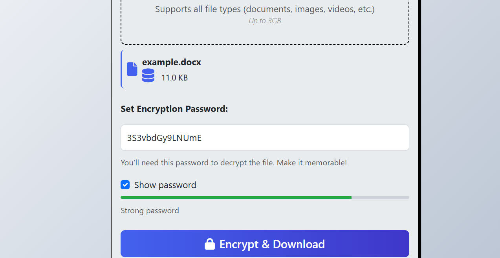

 

Once you've made a strong password, click 'Encrypt & Download'. Instructions for how to edit your encrypted file name are under the 'Encrypt & Download ' button. It's important you read those instructions if you plan to edit the name of your file.

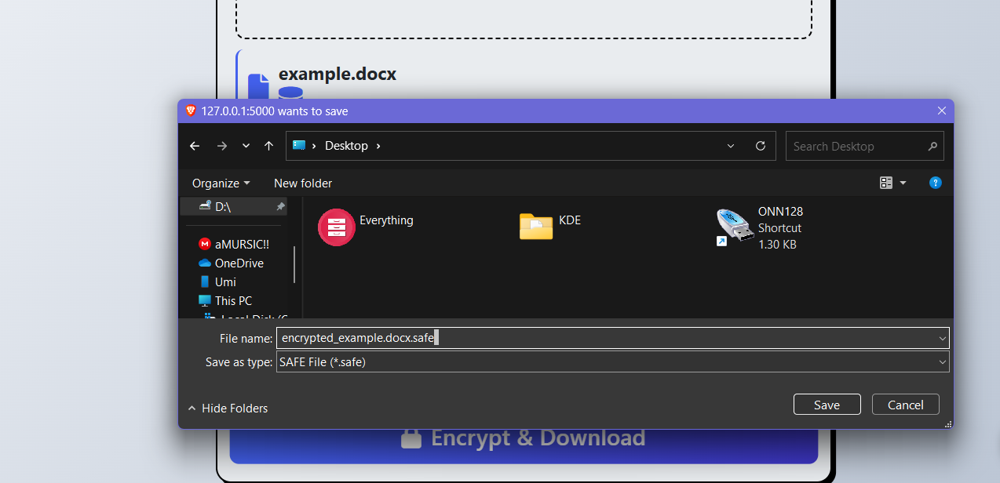

 

Here we have our new encrypted file with the .safe extension. We're going to open it to show what will be seen if someone tried to access it.

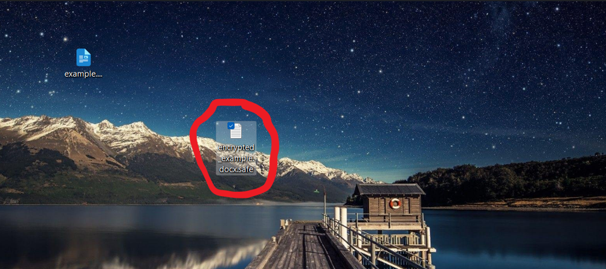

 

As you can see, our file has been completely scrambled with over 11,000 random characters.

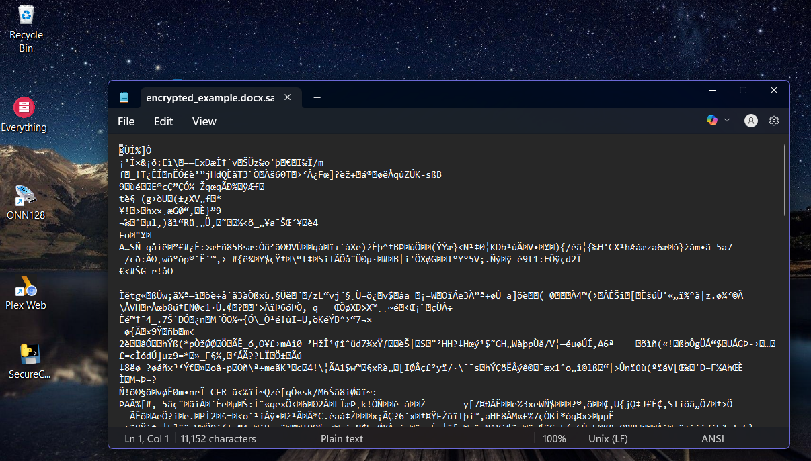

 

Next, we're going to click the 'Decrypt a File' button, as seen on the second picture, and upload our encrypted file. We're going to type in our password and click the 'Decrypt & Download' button.

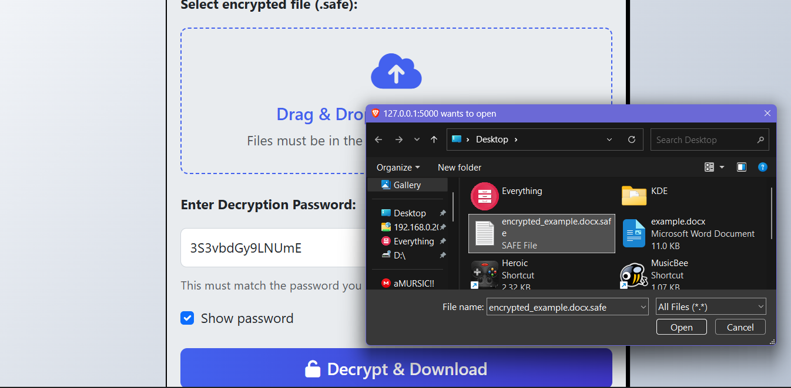

 

And just like that, we have decrypted our file. Let's open it up to see if it worked.

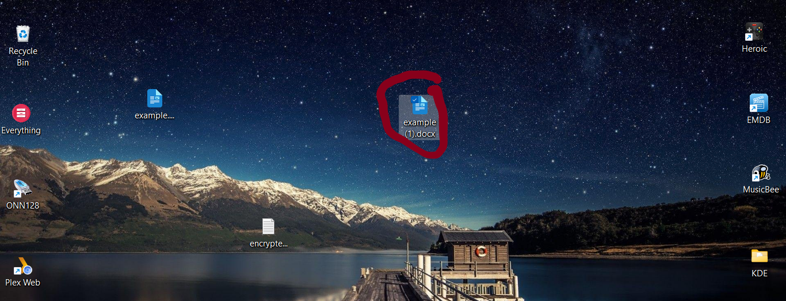

 

Our decrypted file.

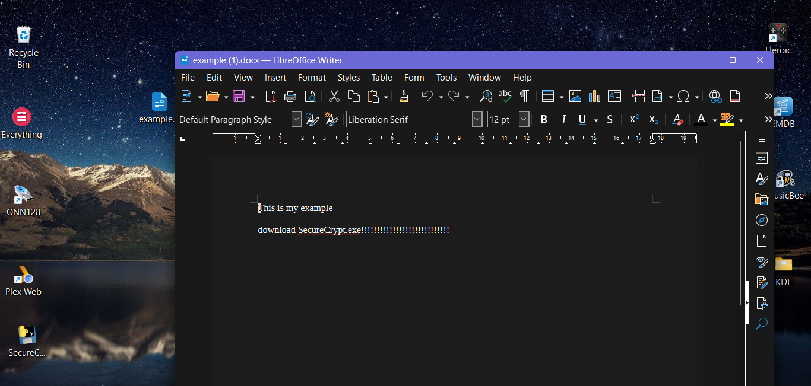

 

Windows Security Notice: Windows Defender may block you from opening the .exe because the publisher is not recognized. This is to protect your computer.

 If Windows Defender blocks .exe:
Right-click on the file and select "Properties"
You will see an "Unblock" checkbox in the General tab, check it and click "Apply"
When you run the file, if Windows shows a warning, click "More info" then "Run anyway"

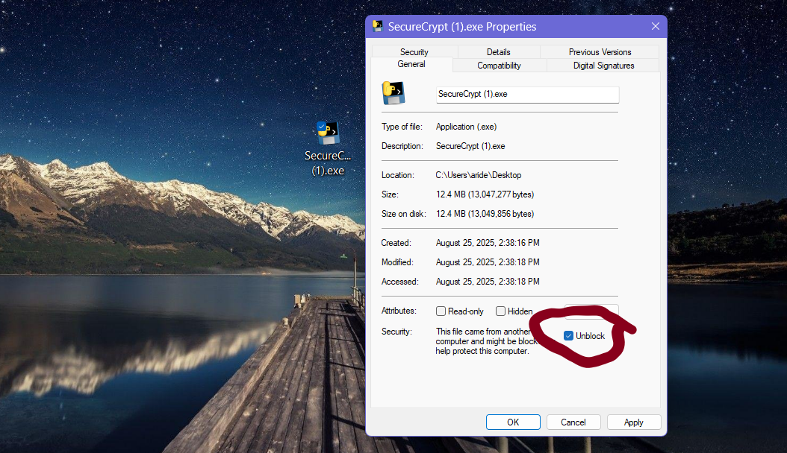

